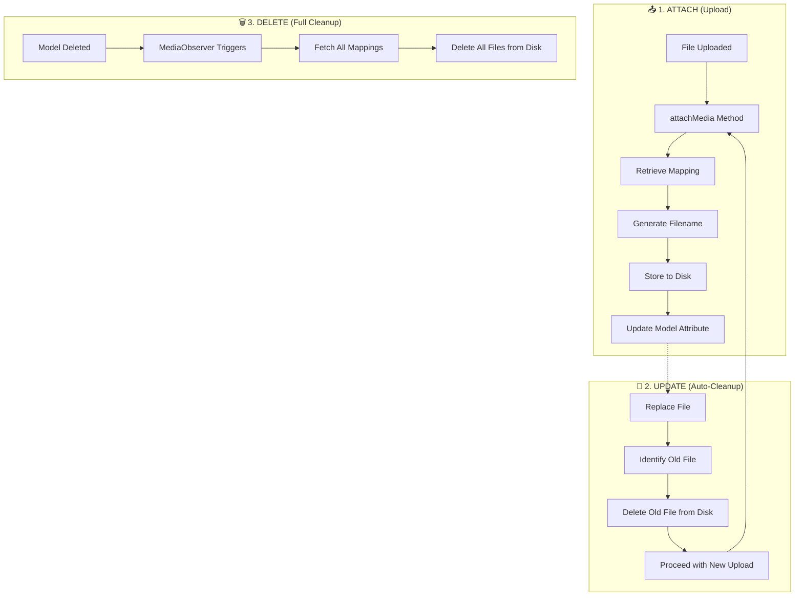

# 🖼️ Laravel Model Media

<p align="center">
<a href="https://packagist.org/packages/dialloibrahima/laravel-model-media"></a>
<a href="https://github.com/ibra379/laravel-model-media/actions?query=workflow%3Arun-tests+branch%3Amain"></a>
<a href="https://packagist.org/packages/dialloibrahima/laravel-model-media"></a>
<a href="https://www.php.net/"></a>
<a href="https://laravel.com/"></a>
</p>

A lightweight, zero-boilerplate media management trait for Laravel Eloquent models. Attach files directly to your existing model attributes without adding any extra database tables or complex relationships.

---

## 📋 Table of Contents
- [The Problem](https://github.com/ibra379/laravel-model-media#-the-problem)
- [The Solution](https://github.com/ibra379/laravel-model-media#-the-solution)
- [Comparison: Spatie vs. Model Media](https://github.com/ibra379/laravel-model-media#-comparison-spatie-medialibrary-vs-laravel-model-media)
- [Installation](https://github.com/ibra379/laravel-model-media#-installation)
- [Quick Start](https://github.com/ibra379/laravel-model-media#-quick-start)
- [Advanced Usage](https://github.com/ibra379/laravel-model-media#-advanced-usage)
- [How It Works](https://github.com/ibra379/laravel-model-media#-how-it-works)
- [Testing](https://github.com/ibra379/laravel-model-media#-testing)

---

## 😰 The Problem
Most media management packages for Laravel (like Spatie MediaLibrary) are powerful but "heavy". They often require:
- A new `media` table in your database.
- Complex Polymorphic relationships.
- Manual cleanup of files when models are deleted.
- Overkill for simple use cases where you just want to store a profile picture or a document path directly on a model.

## ✨ The Solution
**Laravel Model Media** keeps it simple. It uses your **existing database columns** to store file names.
- ✅ **No Extra Tables**: Uses the columns you already have.
- ✅ **Automatic Cleanup**: Deletes old files when you re-upload or delete the model.
- ✅ **Smart Filenames**: Use model attributes or dynamic Closures for naming.
- ✅ **Zero Config**: Just add the trait and register your media.

---

## ⚖️ Comparison: Spatie MediaLibrary vs. Laravel Model Media

| Feature | Spatie MediaLibrary | Laravel Model Media |
| :--- | :---: | :---: |
| **Philosophy** | "One table for everything" | "Keep it on the model" |
| **New Tables** | `media` (Polymorphic) | **None** |
| **Complexity** | High (Conversions, Collections) | **Low** (Simple & Fast) |
| **Performance** | Extra Join/Query for each model | **Zero extra queries** |
| **Setup** | Migrations + Trait + Interface | **Trait only** |
| **Ideal for** | Complex CMS, Multiple galleries | Profile pics, Single documents, Simple uploads |

---

## 📦 Installation

```bash
composer require dialloibrahima/laravel-model-media
```

---

## ⚡ Quick Start

### 1. Prepare your Model
Add the `HasMedia` trait and register which column should handle media.

```php
namespace App\Models;

use DialloIbrahima\HasMedia\HasMedia;
use Illuminate\Database\Eloquent\Model;

class User extends Model
{
    use HasMedia;

    protected static function booted()
    {
        self::registerMediaForColumn(
            column: 'profile_photo',    // Your DB column
            directory: 'avatars',       // Storage folder
            fileName: 'id',             // Name file after the user ID
            disk: 'public'              // Optional: storage disk (default is 'public')
        );
    }
}
```

### 2. Handle Uploads
Call `attachMedia()` in your controller.

```php
public function update(Request $request, User $user)
{
    if ($request->hasFile('photo')) {
        $user->attachMedia($request->file('photo'), 'profile_photo');
    }

    return back();
}
```

### 3. Retrieve URLs
```php
getMediaUrl('profile_photo') }}">
```

---

## 🔧 Advanced Usage

### Dynamic Filenames via Closure
If you need complex naming logic (like adding a random string or using another attribute), use a Closure:

```php
self::registerMediaForColumn(
    column: 'invoice_pdf',
    directory: 'invoices',
    fileName: fn ($model, $file) => "invoice-{$model->number}-" . Str::random(5)
);
```

### Automatic Cleanup
You don't need to do anything! Laravel Model Media automatically:
- **Deletes the old file** when you re-upload a new one to the same column.
- **Deletes all associated files** when the model is deleted (via Model Observer).

---

## 🏗️ How It Works



---

## 🧪 Testing

The package includes a robust test suite. You can run it via composer:

```bash
composer test
```

We test for:
- ✅ Correct storage path and filename generation.
- ✅ Automatic deletion of old media on update.
- ✅ Garbage collection of files on model deletion.
- ✅ Prediction and predictability using faked storage and string overrides.

---

## 🤝 Contributing
Please see [CONTRIBUTING](CONTRIBUTING.md) for details.

## 📄 License
The MIT License (MIT). Please see [License File](LICENSE.md) for more information.

## 👨‍💻 Credits
- [Ibrahima Diallo](https://github.com/ibra379)
- [All Contributors](../../contributors)
