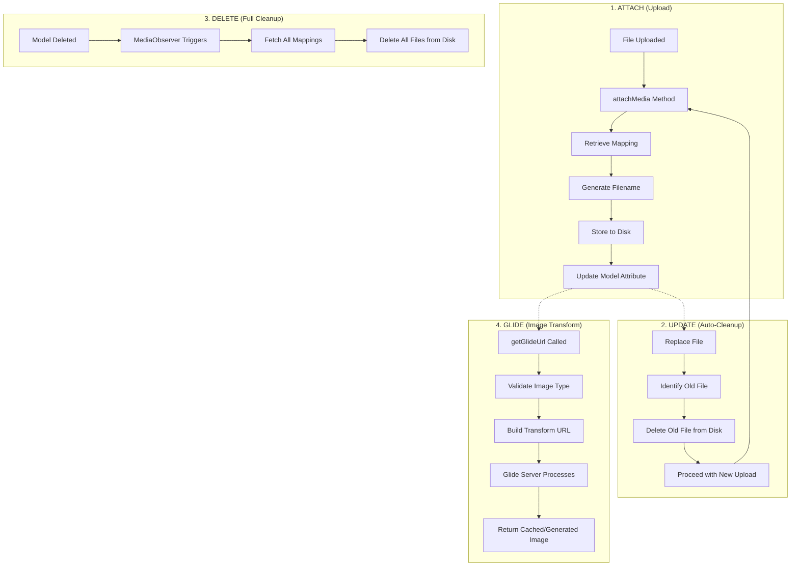

<p align="center">
<a href="https://packagist.org/packages/dialloibrahima/laravel-model-media"></a>
<a href="https://github.com/ibra379/laravel-model-media/actions?query=workflow%3Arun-tests+branch%3Amain"></a>
<a href="https://packagist.org/packages/dialloibrahima/laravel-model-media"></a>
<a href="https://www.php.net/"></a>
<a href="https://laravel.com/"></a>
</p>

A lightweight, zero-boilerplate media management trait for Laravel Eloquent models. Attach files directly to your existing model attributes without adding any extra database tables or complex relationships.

> [!TIP]
> **Includes a built-in Glide integration** for on-the-fly image manipulation: resize, crop, convert formats, and generate responsive images.

---

## Table of Contents

- [The Problem](#-the-problem)
- [The Solution](#-the-solution)
- [Comparison: Spatie vs. Model Media](#-comparison-spatie-medialibrary-vs-laravel-model-media)
- [Installation](#-installation)
- [Quick Start](#-quick-start)
- [API Reference](#-api-reference)
  - [HasMedia Trait](#hasmedia-trait)
  - [HasGlideUrls Trait](#hasglideurls-trait)
- [Advanced Usage](#-advanced-usage)
  - [Dynamic Filenames](#dynamic-filenames-via-closure)
  - [Multiple Disks](#multiple-storage-disks)
  - [Automatic Cleanup](#automatic-cleanup)
- [Image Manipulation with Glide](#-image-manipulation-with-glide)
  - [Basic Usage](#glide-basic-usage)
  - [Transformation Parameters](#transformation-parameters)
  - [Presets](#using-presets)
  - [Responsive Images](#responsive-images-srcset)
  - [Standalone Usage (Facade)](#standalone-usage-facade)
  - [Configuration](#glide-configuration)
  - [Security](#security)
  - [Cache Cleanup](#automatic-cache-cleanup)
- [How It Works](#-how-it-works)
- [Testing](#-testing)
- [Contributing](#-contributing)

---

## The Problem

Most media management packages for Laravel (like Spatie MediaLibrary) are powerful but "heavy". They often require:
- A new `media` table in your database.
- Complex Polymorphic relationships.
- Manual cleanup of files when models are deleted.
- Overkill for simple use cases where you just want to store a profile picture or a document path directly on a model.

## The Solution

**Laravel Model Media** keeps it simple. It uses your **existing database columns** to store file names.
- **No Extra Tables**: Uses the columns you already have.
- **Automatic Cleanup**: Deletes old files when you re-upload or delete the model.
- **Smart Filenames**: Use model attributes or dynamic Closures for naming.
- **Zero Config**: Just add the trait and register your media.
- **Image Manipulation**: Built-in Glide integration for resizing, cropping, and format conversion.
- **Responsive Images**: Generate srcsets for `<picture>` elements automatically.

---

## Comparison: Spatie MediaLibrary vs. Laravel Model Media

| Feature | Spatie MediaLibrary | Laravel Model Media |
| :--- | :---: | :---: |
| **Philosophy** | "One table for everything" | "Keep it on the model" |
| **New Tables** | `media` (Polymorphic) | **None** |
| **Complexity** | High (Conversions, Collections) | **Low** (Simple & Fast) |
| **Performance** | Extra Join/Query for each model | **Zero extra queries** |
| **Setup** | Migrations + Trait + Interface | **Trait only** |
| **Image Manipulation** | Built-in conversions | **Glide** (included) |
| **Ideal for** | Complex CMS, Multiple galleries | Profile pics, Single documents, Simple uploads |

---

## Installation

```bash
composer require dialloibrahima/laravel-model-media
```

This installs `league/glide` automatically as a dependency, giving you image manipulation out of the box.

---

## Quick Start

### 1. Prepare your Model

Add the `HasMedia` trait and register which column should handle media.

```php
namespace App\Models;

use DialloIbrahima\HasMedia\HasMedia;
use Illuminate\Database\Eloquent\Model;

class User extends Model
{
    use HasMedia;

    protected static function booted()
    {
        self::registerMediaForColumn(
            column: 'profile_photo',    // Your DB column
            directory: 'avatars',       // Storage folder
            fileName: 'id',             // Name file after a model attribute (or use a Closure)
            disk: 'public'              // Optional: storage disk (default is 'public')
        );
    }
}
```

> [!NOTE]
> The `fileName` parameter can be a model attribute name (like `'slug'`) or a `Closure` for more complex naming logic.

### 2. Handle Uploads

Call `attachMedia()` in your controller.

```php
public function update(Request $request, User $user)
{
    if ($request->hasFile('photo')) {
        // This method automatically saves the model for you!
        $user->attachMedia($request->file('photo'), 'profile_photo');
    }

    return back();
}
```

> [!IMPORTANT]
> `attachMedia` automatically calls `$this->save()`. You don't need to manually save the model unless you perform other modifications.

### 3. Retrieve URLs

```blade
getMediaUrl('profile_photo') }}">
```

### 4. Delete Media

```php
// Remove media and clear the column
$user->detachMedia('profile_photo');

// Media is also automatically deleted when the model is deleted
$user->delete(); // Files are cleaned up automatically
```

---

## API Reference

### HasMedia Trait

The core trait that provides media management capabilities.

#### `registerMediaForColumn()`

Register a media mapping for a model column.

```php
protected static function registerMediaForColumn(
    string $column,              // Database column name
    string $directory,           // Storage directory
    string|Closure $fileName,    // Attribute name or Closure for filename
    string $disk = 'public'      // Storage disk
): void
```

#### `attachMedia()`

Attach an uploaded file to a column.

```php
public function attachMedia(UploadedFile $file, string $column): bool
```

**Returns:** `true` if storage was successful, `false` otherwise.

**Behavior:**
- Stores the file to the configured disk and directory
- Updates the model attribute with the new filename
- **Automatically calls `$this->save()`** to persist the changes
- Deletes any previously attached file (if the filename differs) **only after** the model is saved successfully, so a failed save never removes the old file

#### `detachMedia()`

Remove media from a column and delete the file.

```php
public function detachMedia(?string $column): bool
```

**Returns:** `true` when complete.

**Behavior:**
- Deletes the file from disk
- Sets the column to `null` and saves (only if the model still exists in the database)
- Passing `null` is a safe no-op that returns `true`

#### `getMediaUrl()`

Get the public URL for a media file.

```php
public function getMediaUrl(string $column): ?string
```

**Returns:** The full URL to the file, or `null` if no file is attached.

#### `getMediaMappings()`

Get all registered media mappings for the model.

```php
public function getMediaMappings(): array
```

> [!NOTE]
> Media mappings are scoped per model class. Each model maintains its own independent set of column mappings, so you can safely use `HasMedia` on multiple models without conflicts.

---

### HasGlideUrls Trait

Adds Glide image manipulation capabilities. Requires the `HasMedia` trait on the same model.

> [!CAUTION]
> This trait only works with image files. It validates MIME types and returns `null` (or throws `InvalidMediaTypeException` when `throwOnError` is `true`) for non-image files.

#### `getGlideUrl()`

Generate a URL for a transformed image.

```php
public function getGlideUrl(
    string $column,              // Column name
    array $params = [],          // Glide transformation parameters
    bool $throwOnError = false   // Throw exception on error
): ?string
```

**Returns:** URL to the transformed image, or `null` if unavailable.

```php
// Basic resize
$user->getGlideUrl('avatar', ['w' => 200, 'h' => 200]);

// Crop to square
$user->getGlideUrl('avatar', ['w' => 300, 'h' => 300, 'fit' => 'crop']);

// Convert to WebP
$user->getGlideUrl('avatar', ['w' => 400, 'fm' => 'webp', 'q' => 85]);

// With error handling
try {
    $url = $user->getGlideUrl('document', ['w' => 200], throwOnError: true);
} catch (InvalidMediaTypeException $e) {
    // Handle non-image file
}
```

#### `getGlidePresetUrl()`

Generate a URL using a predefined preset.

```php
public function getGlidePresetUrl(
    string $column,              // Column name
    string $preset,              // Preset name from config
    bool $throwOnError = false   // Throw exception on error
): ?string
```

**Returns:** URL with preset parameters applied, or `null` if the preset doesn't exist or the file is not a valid image.

```php
// Use thumbnail preset (defined in config)
$user->getGlidePresetUrl('avatar', 'thumbnail');

// Use medium preset
$user->getGlidePresetUrl('cover', 'medium');
```

#### `getGlideSrcset()`

Generate a srcset attribute for responsive images.

```php
public function getGlideSrcset(
    string $column,                               // Column name
    array $widths = [400, 800, 1200, 1600],       // Image widths
    bool $throwOnError = false                    // Throw exception on error
): ?string
```

```php
// Default widths
$srcset = $user->getGlideSrcset('cover');
// Result: "http://...?w=400&fm=webp 400w, http://...?w=800&fm=webp 800w, ..."

// Custom widths for mobile-first
$srcset = $user->getGlideSrcset('hero', [375, 768, 1024, 1920]);
```

**Usage in Blade:**

```blade
getGlideUrl('cover', ['w' => 800]) }}"
    srcset="{{ $post->getGlideSrcset('cover') }}"
    sizes="(max-width: 768px) 100vw, 800px"
    alt="{{ $post->title }}"
>
```

#### `hasImageMedia()`

Check if a column contains a valid image file.

```php
public function hasImageMedia(string $column): bool
```

```blade
@if($user->hasImageMedia('avatar'))
    getGlideUrl('avatar', ['w' => 200]) }}">
@else
    
@endif
```

---

## Advanced Usage

### Dynamic Filenames via Closure

If you need complex naming logic, use a Closure:

```php
use Illuminate\Support\Str;

self::registerMediaForColumn(
    column: 'invoice_pdf',
    directory: 'invoices',
    fileName: fn ($model, $file) => "invoice-{$model->number}-" . Str::random(5)
);
// Result: invoice-INV-001-x7kP2.pdf
```

The Closure receives:
- `$model` - The Eloquent model instance
- `$file` - The `UploadedFile` instance

### Multiple Storage Disks

```php
// Store avatars on public disk
self::registerMediaForColumn(
    column: 'avatar',
    directory: 'avatars',
    fileName: 'id',
    disk: 'public'
);

// Store private documents on S3
self::registerMediaForColumn(
    column: 'contract',
    directory: 'contracts',
    fileName: fn ($model) => "contract-{$model->id}",
    disk: 's3'
);
```

### Automatic Cleanup

You don't need to do anything! Laravel Model Media automatically:
- **Deletes the old file** when you re-upload a new one to the same column (only if the filename differs).
- **Deletes all associated files** when the model is deleted (via Model Observer).

> [!NOTE]
> **Soft deletes are respected.** If your model uses the `SoftDeletes` trait, media files are **kept** on a soft delete and removed only on `forceDelete()`. This means a `restore()` always brings back a record that still has its files.

---

## Image Manipulation with Glide

The package includes a built-in [Glide](https://glide.thephpleague.com/) integration for on-the-fly image manipulation.

Add the `HasGlideUrls` trait to your model alongside `HasMedia`:

```php
use DialloIbrahima\HasMedia\HasMedia;
use DialloIbrahima\HasMedia\Plugins\Glide\HasGlideUrls;

class User extends Model
{
    use HasMedia, HasGlideUrls;

    // ...
}
```

Publish the Glide configuration:

```bash
php artisan vendor:publish --tag=model-media-glide-config
```

### Glide Basic Usage

Once configured, the `HasGlideUrls` trait provides convenient methods to generate URLs directly from your models:

```php
// Resize to 200x200
$url = $user->getGlideUrl('avatar', ['w' => 200, 'h' => 200]);

// Crop to fit
$url = $user->getGlideUrl('avatar', ['w' => 300, 'h' => 300, 'fit' => 'crop']);

// Use a preset defined in config
$url = $user->getGlidePresetUrl('avatar', 'thumbnail');

// Get a responsive srcset
$srcset = $user->getGlideSrcset('avatar');
```

### Transformation Parameters

| Parameter | Description | Example |
|-----------|-------------|---------|
| `w` | Width in pixels | `['w' => 200]` |
| `h` | Height in pixels | `['h' => 200]` |
| `fit` | Fit mode: `contain`, `max`, `fill`, `stretch`, `crop` | `['fit' => 'crop']` |
| `fm` | Format: `jpg`, `png`, `gif`, `webp` | `['fm' => 'webp']` |
| `q` | Quality (0-100) | `['q' => 85]` |
| `blur` | Blur (0-100) | `['blur' => 5]` |
| `bri` | Brightness (-100 to 100) | `['bri' => 10]` |
| `con` | Contrast (-100 to 100) | `['con' => 10]` |
| `gam` | Gamma (0.1 to 9.99) | `['gam' => 1.5]` |
| `sharp` | Sharpen (0-100) | `['sharp' => 10]` |
| `flip` | Flip: `v` (vertical), `h` (horizontal), `both` | `['flip' => 'h']` |
| `or` | Orientation: `auto`, `0`, `90`, `180`, `270` | `['or' => 'auto']` |
| `border` | Border in format `width,color,method` | `['border' => '5,FFFFFF,overlay']` |

See the [Glide documentation](https://glide.thephpleague.com/) for all available parameters.

### Using Presets

Presets allow you to define reusable transformation sets:

```php
// config/model-media-glide.php
'presets' => [
    'thumbnail' => [
        'w' => 200,
        'h' => 200,
        'fit' => 'crop',
        'fm' => 'webp',
        'q' => 90,
        'or' => 'auto',
    ],
    'medium' => [
        'w' => 800,
        'h' => 600,
        'fit' => 'contain',
        'fm' => 'webp',
        'q' => 85,
        'or' => 'auto',
    ],
    'og-image' => [
        'w' => 1200,
        'h' => 630,
        'fit' => 'crop',
        'fm' => 'jpg',  // Facebook/LinkedIn don't support webp
        'q' => 85,
        'or' => 'auto',
    ],
],
```

Then use them in your code:

```php
$thumbnailUrl = $user->getGlidePresetUrl('avatar', 'thumbnail');
$ogImageUrl = $post->getGlidePresetUrl('cover', 'og-image');
```

> [!NOTE]
> `getGlidePresetUrl()` returns `null` if the preset name doesn't exist in the configuration.

### Responsive Images (srcset)

Generate responsive image sets automatically:

```blade
<picture>
    <source
        srcset="{{ $post->getGlideSrcset('cover', [375, 768, 1024, 1920]) }}"
        sizes="(max-width: 768px) 100vw, (max-width: 1024px) 50vw, 33vw"
    >
    getGlideUrl('cover', ['w' => 800]) }}"
        alt="{{ $post->title }}"
        loading="lazy"
    >
</picture>
```

### Standalone Usage (Facade)

You can generate Glide URLs anywhere (controllers, services, Blade) using the `Glide` facade, even without an Eloquent model:

```php
use DialloIbrahima\HasMedia\Plugins\Glide\Facades\Glide;

// Generate a URL for a specific path
$url = Glide::url('avatars/user-1.jpg', ['w' => 200, 'fit' => 'crop']);

// Use a preset
$url = Glide::preset('posts/cover.png', 'medium');

// Generate a responsive srcset
$srcset = Glide::srcset('products/hero.webp', [400, 800, 1200]);

// Clear cache for a specific file
Glide::deleteCache('avatars/user-1.jpg');
```

> [!NOTE]
> `Glide::url()` automatically validates that the file exists and is a valid image before generating the URL. If validation fails, it returns `null`. `Glide::preset()` also returns `null` if the preset name doesn't exist.

### Glide Configuration

Publish the configuration file:

```bash
php artisan vendor:publish --tag=model-media-glide-config
```

```php
// config/model-media-glide.php
return [
    // Routes
    'routes_enabled' => true,
    'route_prefix' => 'media',
    'middleware' => ['web'],

    // Security (URL Signing)
    'secure' => env('GLIDE_SECURE', false),
    'signature_key' => env('GLIDE_SIGNATURE_KEY', ''),

    // Storage Disks (supports S3, R2, and any Flysystem driver)
    'source_disk' => env('GLIDE_SOURCE_DISK', 'public'),
    'source_path_prefix' => env('GLIDE_SOURCE_PATH_PREFIX', ''),

    'cache_disk' => env('GLIDE_CACHE_DISK', 'local'),
    'cache_path' => env('GLIDE_CACHE_PATH', 'glide-cache'),

    'watermarks_disk' => env('GLIDE_WATERMARKS_DISK', 'local'),
    'watermarks_path' => env('GLIDE_WATERMARKS_PATH', 'watermarks'),

    // Server
    'driver' => env('GLIDE_DRIVER', 'imagick'), // 'imagick' recommended over 'gd'
    'max_image_size' => env('GLIDE_MAX_IMAGE_SIZE', 4000 * 4000), // 16MP

    // Presets (reusable transformation sets)
    'presets' => [
        'avatar' => ['w' => 110, 'h' => 110, 'fit' => 'crop', 'fm' => 'webp', 'q' => 90, 'or' => 'auto'],
        'thumbnail' => ['w' => 200, 'h' => 200, 'fit' => 'crop', 'fm' => 'webp', 'q' => 90, 'or' => 'auto'],
        // ...
    ],
];
```

> [!TIP]
> The package uses **Laravel disk names** instead of hardcoded paths. This means it works seamlessly with S3, Cloudflare R2, or any Flysystem driver. Just set `GLIDE_SOURCE_DISK=s3` in your `.env` file.

> [!IMPORTANT]
> `imagick` is strongly recommended over `gd` as the image driver. Imagick uses Lanczos resampling which produces sharper, cleaner results compared to gd's bilinear interpolation. Verify it's installed with `php -m | grep imagick`.

### Optimization Support

The package is fully compatible with Laravel's optimization system:

```bash
php artisan optimize
```

This will cache your configuration and routes while maintaining full functionality, including secure image signatures.

### Security

Enable URL signing to prevent unauthorized image manipulation (DoS protection):

```env
GLIDE_SECURE=true
GLIDE_SIGNATURE_KEY=your-32-character-random-string
```

Generate a secure key:

```bash
php artisan tinker
>>> Str::random(32)
```

When secure mode is enabled, all Glide URLs will be cryptographically signed. Requests with invalid or missing signatures receive a `403` response.

### Automatic Cache Cleanup

The `HasGlideUrls` trait automatically registers a `GlideCacheObserver` that cleans up cached images when:

- **Image is updated**: When you attach a new image to a column, the old cached versions are deleted
- **Model is deleted**: All cached images for the model are removed

> [!NOTE]
> Like the file cleanup, this is **soft-delete aware**: the Glide cache is kept on a soft delete and purged only on `forceDelete()`.

This happens automatically - you don't need to configure anything. The observer:

1. Detects when a media column changes
2. Finds cached transformations for the old image
3. Deletes them from the Glide cache directory

This prevents stale cached images from being served and saves disk space.

**Manual Cache Clearing**

If you need to manually clear the cache for a specific image:

```php
use DialloIbrahima\HasMedia\Plugins\Glide\Facades\Glide;

Glide::deleteCache('avatars/user-1.jpg');
```

---

## Configuration

You can publish the configuration files to customize the package behavior:

```bash
# Publish all configurations
php artisan vendor:publish --provider="DialloIbrahima\HasMedia\LaravelModelMediaServiceProvider"

# Or use specific tags
php artisan vendor:publish --tag=laravel-model-media-config
php artisan vendor:publish --tag=model-media-glide-config
```

- `laravel-model-media-config`: General settings.
- `model-media-glide-config`: Glide-specific settings (storage disks, presets, security, image driver).

---

## How It Works



---

## Testing

The package includes a robust test suite. You can run it via composer:

```bash
composer test
```

We test for:
- Correct storage path and filename generation
- Automatic deletion of old media on update
- Garbage collection of files on model deletion
- Soft-delete awareness (files and cache kept on soft delete, removed on force delete)
- Glide URL generation and transformation
- Glide preset and srcset generation
- Image type validation (only images allowed for Glide)
- Error handling for non-image files (`InvalidMediaTypeException`)
- Glide response factory (streaming, caching headers, 304 Not Modified)
- Signature validation for secure URLs

---

## Contributing

Please see [CONTRIBUTING](CONTRIBUTING.md) for details.

## License

The MIT License (MIT). Please see [License File](LICENSE.md) for more information.

## Credits

- [Ibrahima Diallo](https://github.com/ibra379)
- [All Contributors](../../contributors)
